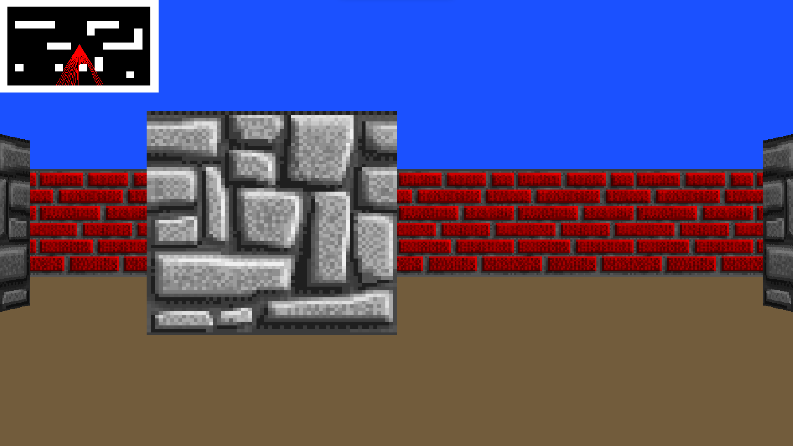
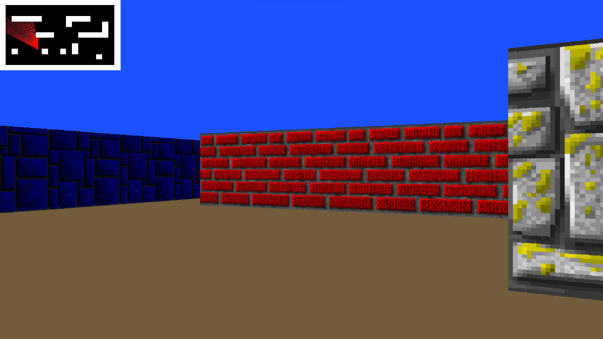

# The Maze

The Maze is an exciting 3D Maze game that leverages raycasting to transform a 2D map into an immersive 3D navigable world! The game is crafted in C using the powerful SDL2 library, with development carried out on Ubuntu 20.04.

### About SDL2 

[](https://www.libsdl.org/)

Simple DirectMedia Layer is a cross-platform development library designed to provide low-level access to audio, keyboard, mouse, joystick, and graphics hardware via OpenGL and Direct3D. It is widely used in video playback software, emulators, and popular games, including Valve's award-winning catalog and many Humble Bundle games.

## Installation 
```bash
$ git clone https://github.com/saberamine0/The-Maze-3D-Game.git
$ cd The-Maze-3D-Game
Usage
Execute ./maze or type make run
Use up and down arrow keys to move forward and backward (keys W and S serve the same function)
Use right and left arrow keys to turn the camera around (keys D and A serve the same function)
Compilation
bash
Copy code
$ gcc -Wall -Werror -Wextra -pedantic ./src/*.c -lm -o maze `sdl2-config --cflags` `sdl2-config --libs`
The Game
<p align="center">
  
  
</p>
<p align="center">
  <sub>Built with ❤️ by SABER </sub>
</p>
```